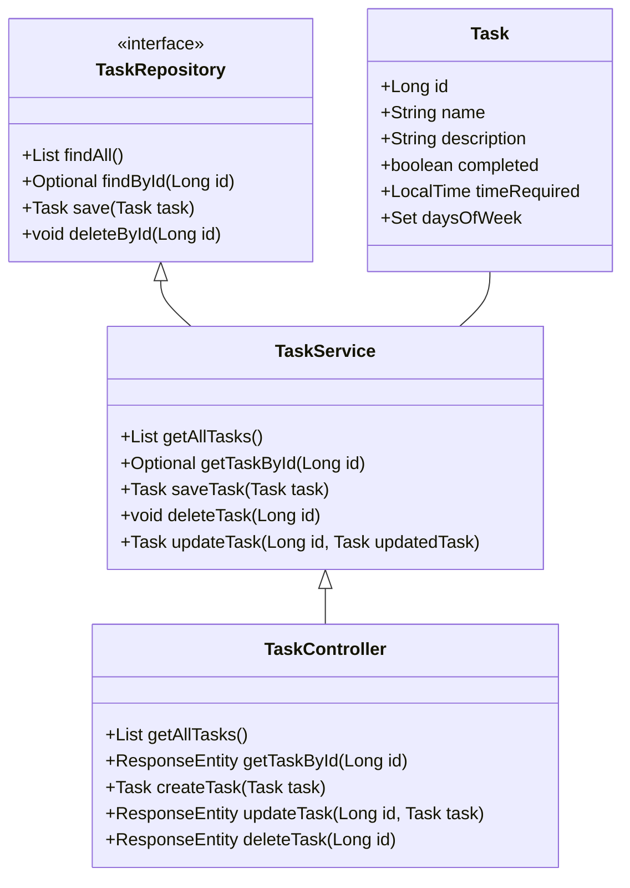

# Bootcamp Santander DIO 2024
Java RESTful API criada para o Bootcamp Santander 2024.

## Diagrama de Classes

```mermaid
classDiagram
    class Task {
        +Long id
        +String name
        +String description
        +boolean completed
        +LocalTime timeRequired
        +Set<DayOfWeek> daysOfWeek
    }

    class TaskRepository {
        <<interface>>
        +List<Task> findAll()
        +Optional<Task> findById(Long id)
        +Task save(Task task)
        +void deleteById(Long id)
    }

    class TaskService {
        +List<Task> getAllTasks()
        +Optional<Task> getTaskById(Long id)
        +Task saveTask(Task task)
        +void deleteTask(Long id)
        +Task updateTask(Long id, Task updatedTask)
    }

    class TaskController {
        +List<Task> getAllTasks()
        +ResponseEntity<Task> getTaskById(Long id)
        +Task createTask(Task task)
        +ResponseEntity<Task> updateTask(Long id, Task task)
        +ResponseEntity<Void> deleteTask(Long id)
    }

    TaskRepository <|-- TaskService
    TaskService <|-- TaskController
    Task -- TaskService
```
