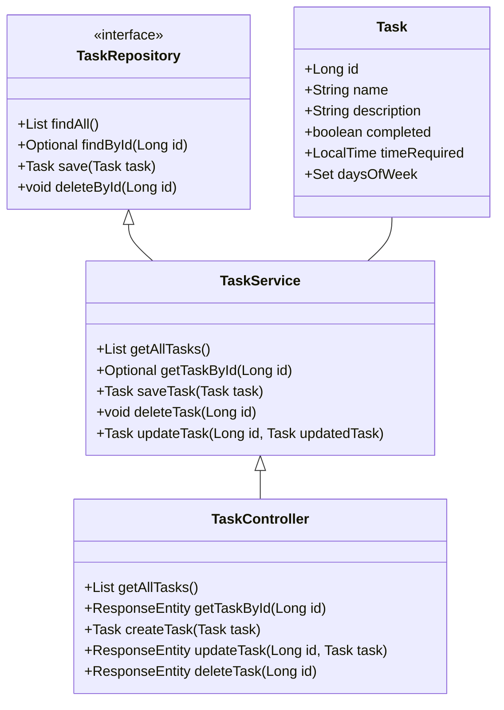

# Task List API

## Descrição

Task List API é uma aplicação RESTful construída com Spring Boot e Java 17. Ela permite gerenciar uma lista de tarefas, incluindo a adição, exclusão, atualização de tarefas, marcação de tarefas como concluídas ou pendentes, e agendamento de tarefas em dias específicos da semana.

## Principais Tecnologias
 - **Java 17**: Utilizaremos a versão LTS mais recente do Java para tirar vantagem das últimas inovações que essa linguagem robusta e amplamente utilizada oferece;
 - **Spring Boot 3**: Trabalharemos com a mais nova versão do Spring Boot, que maximiza a produtividade do desenvolvedor por meio de sua poderosa premissa de autoconfiguração;
 - **Spring Data JPA**: Exploraremos como essa ferramenta pode simplificar nossa camada de acesso aos dados, facilitando a integração com bancos de dados SQL;
 - **Railway**: facilita o deploy e monitoramento de nossas soluções na nuvem, além de oferecer diversos bancos de dados como serviço e pipelines de CI/CD.

## Funcionalidades

- Adicionar novas tarefas
- Excluir tarefas existentes
- Atualizar tarefas
- Marcar tarefas como concluídas ou pendentes
- Especificar o tempo necessário para completar as tarefas
- Agendar tarefas para dias específicos da semana

## Pré-requisitos

- Java 17 ou superior
- Maven
- Conta no Railway

## Diagrama de Classes

